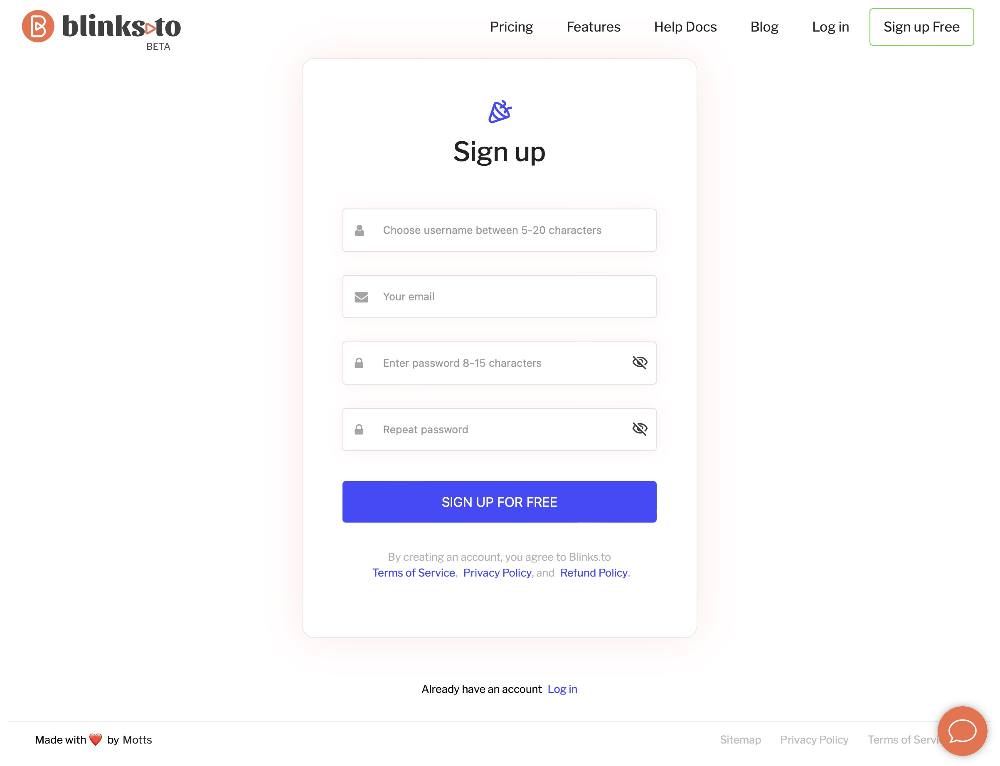

# 📪 Create a free account

Welcome to quic.ly, the premier URL shortening service that transforms long, unwieldy links into short, user-friendly URLs. Follow these simple steps to create your account and start shortening URLs today.

### STEP 1: **Visit the Sign-Up Page**

Navigate to [quic.ly](http://quic.ly/) and click on the "Sign Up" button, usually located at the top right corner of the homepage.

<figure><figcaption>
Img 1: Signup for free form
</figcaption></figure>

### **Step 2: Fill Out the Registration Form**

* **Username**: Choose a unique username that will be associated with your account.
* **Email Address**: Enter a valid email address. We will use this to verify your account and for account recovery purposes.
* **Password**: Create a strong password. Ensure it is at least 8 characters long, and includes a mix of letters, numbers, and symbols for enhanced security.
* **Confirm Password**: Re-enter your password to confirm
* **Terms & Conditions**: Read through our [Terms of Service](https://chat.openai.com/#terms-of-service) and [Privacy Policy](https://chat.openai.com/#privacy-policy). By signing in you agree to the terms.
* **Click on Sign u**p for Free Button to confirm


Once you confirm, you will be taken to the below page requesting you to check the email for a confirmation email. Proceed as instructed


<figure><figcaption></figcaption></figure>

### **Step 4: Verify Your Email**

After submitting the signup form, check your email inbox (and your spam folder) for a verification email from us. Click the <mark style="color:orange;">**"Confirm Email Address"**</mark> link inside the email to activate your account.

<figure><figcaption></figcaption></figure>


On confirming your email address, you are directed to the account confirmed success page for a few seconds and then redirected to the login page


<figure><figcaption></figcaption></figure>
