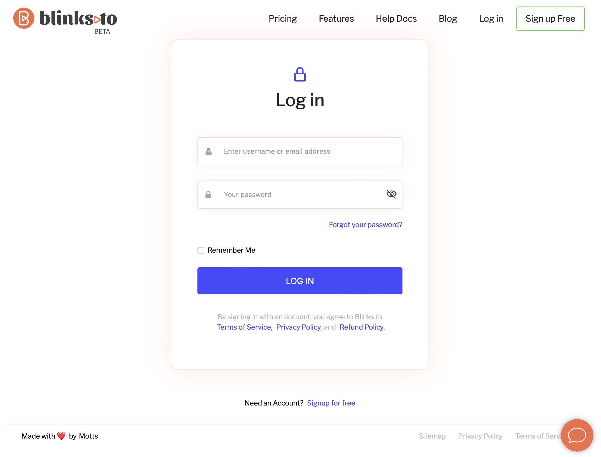

# 👩💻 How to log in?

Accessing your blinks.to account is quick and easy. Follow the steps below to log in and start shortening URLs in no time

### **Step 1: Go to the Log In Page**

Visit [blinks.to ](https://www.blinks.to/login)and click on the "Log In" button, usually located at the top right corner of the homepage.

<figure><figcaption>
Img 1 - Login Form
</figcaption></figure>

### **Step 2: Enter Your Credentials**

* **Username**: Enter the username or email associated with your account.
* **Password**: Enter your account password.


Check **Remember me so** that you can continue being logged in for 24 hours, without having to providing your login credentials again


<figure><figcaption></figcaption></figure>

### **Step 3: Click “Log In”**

After entering your credentials, click the “Log In” button to access your account.


**Forgotten Password?**

If you’ve forgotten your password, click on the “Forgot Password?” link. Enter your registered email address, and we’ll send you instructions on how to reset your password.


### **Step 4: Start Shortening URLs**

Once logged in, you are ready to start using blinks.to to shorten URLs, manage your links, and analyse click data.
