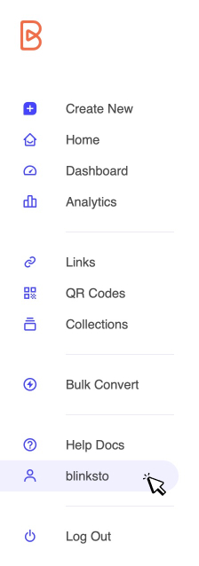

# ☺️ My Account

"Your Account is the gateway to all aspects of your quic.ly experience, encompassing account settings, preferences, billing and usage, current plan details, custom domains, and more.

To access your account details, simply click on your username in the sidebar or select 'User Settings' from the top menu bar.

<figure><figcaption>
Img 1 - Access your account using username
</figcaption></figure>

<figure><figcaption>
Img 2 - User settings pop up menu on top right of top menu bar
</figcaption></figure>

###

### <mark style="color:purple;">My Account submenu</mark>

My account page is divided into four sections based on specific functions.&#x20;

<figure><figcaption>
Img 3 - My Account page submenu
</figcaption></figure>

1. **Account Details:** Access your:
   * Profile Details
   * Account Security
   * Data Export
   * Access History
   * Account Deletion
2. **Billing & Usage:** Explore:
   * Current Plan details and Limits
   * Monthly usage based on your plan limits
3. **Settings:** Customize your:
   * Default domain setting
4. **Custom Domain:** Manage your:
   * Custom branded domain (available in paid plans). Learn how to add, configure, and view existing domains.

