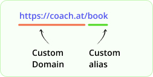

# 🔗 Anatomy of a short url

&#x20;In this section, we’ll break down the key components of a short link, so you know exactly what each part does and how you can utilise them to your advantage.

1. &#x20;<mark style="color:purple;">**Domain**</mark>

* **Description**: The domain is the part of the URL that precedes the short alias. It’s the web address of the URL shortening service.
* **Example**: In the short link `http://blinks.to/dCXdr1`, `blinks.to` is the domain.
* Blinks.to helps to create a shortened url like the one below

<figure><figcaption>
img 1 - A long url typical of a website
</figcaption></figure>

2. <mark style="color:purple;">**Alias**</mark>

* **Shortened url:** Blinks.to converts the long url to a shortened url as shown in image 2.
* **Description**: The alias is the unique identifier that follows the domain in a shortened URL. It’s a randomised string of characters generated by the system.
* **Example**: In `http://blinks.to/dCXdr1`, `dCXdr1` is the alias.

<figure><figcaption>
img 2 - A shortened url with random alias provided by blinks.to
</figcaption></figure>

<figure><figcaption>
img 3 - Domain and alias of shortened url
</figcaption></figure>

3. <mark style="color:purple;">**Custom Alias**</mark>

* **Description**: A custom alias lets users create their own meaningful and memorable short link ending.
* **Example**: Instead of a random string, you can have `http://blinks.to/mycatalog`.
* **How to Use**: During the URL shortening process, choose the option to customize your alias and enter your preferred string.

<figure><figcaption>
img 4 - Shortened url with custom alias
</figcaption></figure>

4. <mark style="color:purple;">**Custom Domain**</mark>

* **Description**: A custom domain allows users to personalise the domain part of their short links. This feature is usually available for premium users.
* **Example**: Using a custom domain, a short link could look like `http://coach.at/book`.
* **How to Use**: To set up a custom domain, you need to configure the DNS settings of your domain to point to our service

<figure><figcaption>
img 5 - shortened url with custom domain and alias
</figcaption></figure>

By understanding these key components, you can create short links that are not only concise but also branded and memorable, providing a better experience for your audience. Ensure to follow best practices for custom aliases to maintain a professional and consistent branding.

