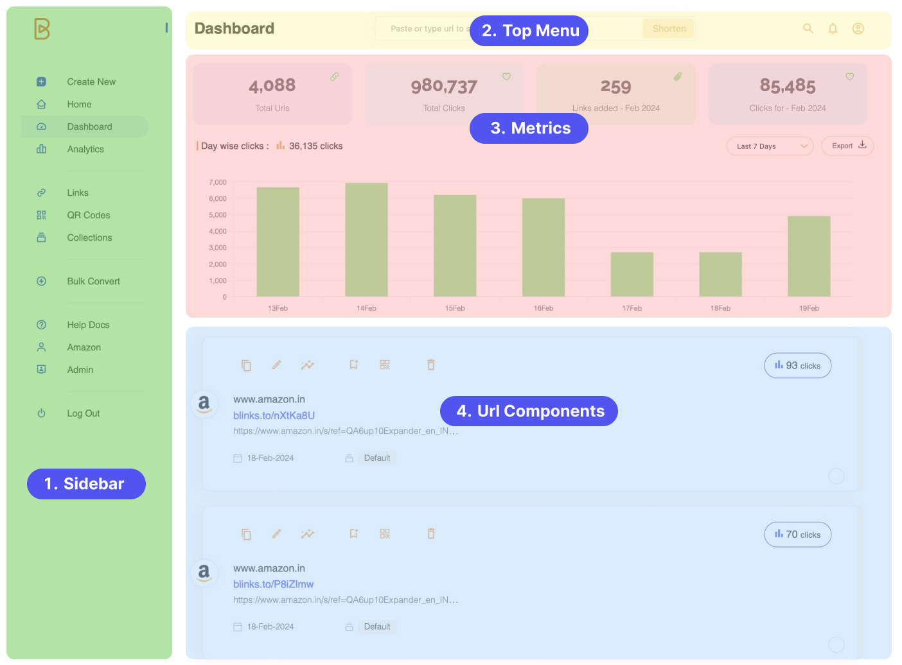

# 🎛 Dashboard Overview

The main dashboard is strategically organized into four primary sections to optimize user navigation and functionality:

<figure><figcaption>
img 1 - Dashboard
</figcaption></figure>

##

<figure><figcaption>
img 2 - Dashboard sections
</figcaption></figure>

## <mark style="color:purple;">1. Sidebar (Navigation Panel):</mark>

* **User & Plan Info:** Displays the current user, their subscription plan, and connection status (indicated by a blinking green circle).

<figure><figcaption>
img 2 - User Info
</figcaption></figure>

### <mark style="color:orange;">Sidebar Accessibility:</mark>

For your convenience, the sidebar is designed to be collapsible, allowing you to maximize your workspace as needed.

**To Toggle Sidebar:**&#x20;

* Look for the toggle icon (represented by a blue vertical small line) situated at the right of the sidebar.
* When you **hover over this line**, it changes to an **arrow icon**—pointing rightwards to indicate expansion, or leftwards to signal retraction.
* Simply **click** on this icon to swiftly **expand or collapse** the sidebar.

This hover-to-reveal functionality allows for a clean interface while providing easy access to expand the sidebar when you need it.


video 1 - Sidebar Toggle - Open & Close


* **Navigation Options:** Provides quick links to various sections of the web app, including:
  * **Create New URL:** A dedicated space for custom URL conversion.
  * **Dashboard:** Your main workspace and overview.
  * **Aggregate Stats:** Displays comprehensive metrics, top URL lists, graphical representations of user interactions based on different categories, and more.
  * **Links:** Access to your complete list of shortened URLs, with extensive filtering and sorting options.
  * **QR Codes:** A specific area for URLs associated with QR codes, retaining all filtering options found in 'Links'.
  * **Campaigns:** View, manage, and create new marketing campaigns, each displayed with relevant statistics.
  * **Bulk Convert:** A utility for mass URL shortening through text input or file uploads, adhering to plan-specific limitations.
  * **Export Links:** Allows users to download their URL data and associated click metrics.
  * **Help Docs:** Directs to this help documentation.
  * **Log Out:** Securely exit your user session.

## <mark style="color:purple;">2. Top Menu Bar:</mark>

* **Search:** A powerful tool to sift through URLs, campaigns, and more, directing users to a results page with additional filtering options.

<figure><figcaption>
img 3 - search tool
</figcaption></figure>

* **Notifications:** Keeps you updated with the latest features, announcements, or personal messages.

<figure><figcaption>
img 4 - Notifications
</figcaption></figure>

* **Profile & Settings:** Quick access to your account settings, help docs, product roadmap, feature requests, and bug reporting.

<figure><figcaption>
img 5 - Profile settings - road map, feature request and more
</figcaption></figure>

## <mark style="color:purple;">3. Metrics Section:</mark>

* **First Row:** Displays aggregate metrics including the total number of URLs, total clicks, monthly URL additions, and monthly clicks.
* **Second Row:** Showcases a bar graph depicting daily clicks with adjustable time periods, plus an option to export the chart as a PNG file.

<figure><figcaption>
img 6 - Metrics Section
</figcaption></figure>

## <mark style="color:purple;">4. URL Shortening and Management:</mark>

* **URL Input:** A central tool for pasting and converting URLs on-the-fly.
* **Converted URL Display:** Below the input field, view your shortened URLs, each with a dedicated component for easy management. Pagination is available to navigate through your URLs, displaying up to 15 per page.

<figure><figcaption>
img 6 - Url shortening and Management
</figcaption></figure>
